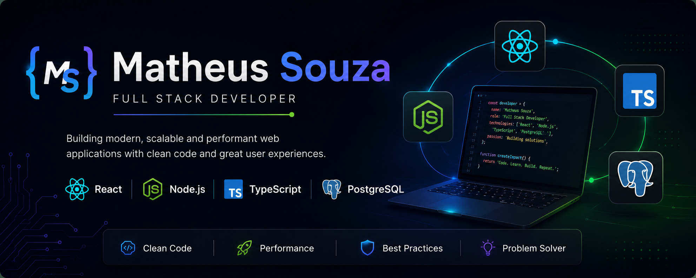

  

<h1 align="center">Hi 👋, I'm Matheus Souza</h1>

<h3 align="center">
Full Stack Developer • Software Engineering Student
</h3>

I build modern, scalable and high-quality web applications using React, Node.js, TypeScript and PostgreSQL.

---

# 👨🏻‍💻 About Me

I'm a **Software Engineering student** and **Full Stack Developer** focused on building modern, scalable, and maintainable web applications.

My expertise includes developing **RESTful APIs** using **Node.js, Express, TypeScript, Prisma ORM, PostgreSQL, JWT Authentication, and Zod**, as well as creating responsive and interactive user interfaces with **React, Vite, Tailwind CSS, HTML, and CSS**.

I enjoy writing clean, maintainable code and applying software engineering best practices, with a strong interest in **Software Architecture, Design Patterns, Clean Code, Automated Testing, and scalable backend systems**.

I'm continuously expanding my knowledge by building real-world projects that deliver reliable, efficient, and user-focused solutions.

---

# 🚀 Tech Stack

## 💻 Languages

---

## ⚛️ Front-end

---

## ⚙️ Back-end

---

## 🗄️ Database & ORM

---

## 🧪 Testing

---

## 🐳 DevOps

---

## 🛠️ Tools

---

## 📚 Concepts

# 🏆 Certification

### 🚀 Rocketseat

**Full Stack Specialization**

✔ 181 Hours

✔ React

✔ Node.js

✔ TypeScript

✔ Express

✔ PostgreSQL

✔ Prisma ORM

✔ Docker

✔ Automated Testing

✔ REST APIs

✔ Deploy

📅 Completed in **July 2026**

---

# 📚 Currently Learning

- Software Architecture
- Clean Code
- SOLID Principles
- Design Patterns
- Data Structures & Algorithms
- Scalable Backend Systems

---

# 🚀 Featured Projects

## 📌 TaskFlow API

Task management REST API built with modern backend technologies.

**Stack**

- TypeScript
- Express
- Prisma ORM
- PostgreSQL
- JWT Authentication
- Docker
- Vitest
- Zod

---

## 💰 Refund API

Backend application for reimbursement management.

**Features**

- Authentication
- Authorization
- Image Upload
- Pagination
- Filters
- Prisma ORM
- PostgreSQL

---

## 🎮 Word Guess Game

Interactive React application.

**Stack**

- React
- TypeScript
- Vite

---

## 🐶 Hair Day

Appointment scheduling interface.

**Stack**

- JavaScript
- Day.js
- Fetch API

---

# 📊 GitHub Stats

---

# 🔥 GitHub Streak

---

# 📈 Contribution Graph

---

# 🎯 Goals

✔ Build production-ready Full Stack applications

✔ Master Software Architecture

✔ Improve Data Structures & Algorithms

✔ Contribute to Open Source

✔ Become a Software Engineer

---

# 📫 Connect with Me

---

> **"First, solve the problem. Then, write the code."**

**— John Johnson**

